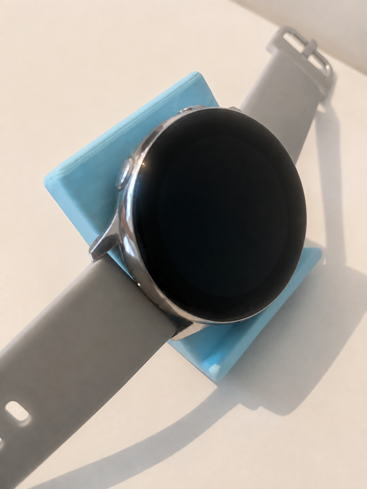

## Vertical Galaxy Watch Charging Stand — Full Project Journal

#### This journal documents the complete design process of creating a custom vertical charging stand for the Samsung Galaxy Watch. The aim was to build a portable, minimal, filament‑efficient stand that integrates the existing charging puck while improving cable management, usability, and overall desk organisation.

## Initial Goals

#### The project began with a clear set of functional and aesthetic goals. I wanted the stand to be compact, visually clean, and efficient to print while still being strong enough to support the Galaxy Watch.

- #### Reduce visible cable length for a cleaner, tidier look  
- #### Make the stand portable and easy to carry  
- #### Keep the design visually appealing and minimal  
- #### Allow the charging puck to slide in and out easily  
- #### Ensure the stand is strong enough to hold the watch securely  
- #### Keep the model simple and easy to print  
- #### Minimise filament usage and avoid unnecessary bulk  

#### These goals shaped the direction of the entire project and influenced every design decision that followed.

## Early Research

#### I started by searching MakerWorld for similar designs. Most of the stands I found were built for the iPhone MagSafe puck. While they looked promising, they were designed to support the weight of an iPhone, which meant they used a lot of excess filament. This went directly against my goal of keeping the design lightweight and efficient.

#### Because of this, I decided to design a fully custom model specifically for the Galaxy Watch. I wanted something that fit the puck perfectly, hid the cable, and didn’t rely on bulky structures.

## First Design Direction

#### My first concept included several important features that aimed to solve the problems I identified with existing designs.

- #### A channel for the cable to loop through  
- #### A slot for the puck to rest securely  
- #### A stopper to prevent the watch from slipping  
- #### The ability for the stand to double as a phone stand (horizontal or vertical)  
- #### Reduced thickness to keep print time low while still fitting the puck  

#### This design focused heavily on practicality. I wanted the puck to fit snugly, the cable to be hidden, and the stand to look clean on a desk. The stopper at the bottom was added to catch the watch if it fell, especially since the Galaxy Watch magnet is weak.

## Early Challenges

#### At the beginning, I struggled a lot with CAD. I wasn’t confident with the tools, and I ended up creating dozens of sketches and models that were either too bulky, impractical, or simply looked wrong. Many of these early attempts were not printable or didn’t meet the goals I set.

- #### Impractical shapes  
- #### Too bulky or heavy  
- #### Not printable without supports  
- #### Designs that simply looked stupid  

#### The first design had space for the cable to run underneath the shell. This helped hide the cable, which was one of the main reasons the design looked good. However, I quickly discovered two major issues with the Galaxy Watch puck: the cable is extremely long, and the magnetic force is very weak.

#### My design addressed these problems by adding a stopper at the bottom to catch the watch if it fell. This also made the stand usable as a phone stand, adding extra functionality.

## Failed Prototype: The Flat‑Area Designs

#### Two of my early designs had a large flat area on the front. These looked clean and modern, but they failed for a reason I didn’t expect: the flat area reduced the strength of the magnet. The magnet simply wasn’t strong enough to work through that much material.

#### Looking back, I should have tested the magnet through something like a credit or debit card to understand how much thickness it could handle. This was a major learning moment and helped me rethink how the puck should be integrated.

## Learning Shapr3D Features

#### Throughout this project, I learned several new Shapr3D features that massively improved my workflow and helped me design faster and more accurately.

- #### Visualisation tools for testing materials and lighting  
- #### 3D render environments to preview the final product  
- #### Projection features for transferring shapes between faces  

#### The visualisation feature allowed me to test different materials and colours. I initially liked the ABS Glossy look, but since I planned to print the stand in blue filament, I selected blue as the base colour in the render.

#### The projection feature was one of the most important tools I learned. By selecting the lower face and projecting it onto the upper face, I was able to cut out a perfect cavity for the puck to slide into. This solved the magnet‑strength issue and made the design far more functional.

#### The Shapr render feature also helped me place the object in realistic lighting conditions. I chose a desk with overhead lighting to see how the stand would look in a real environment. This helped me refine the fillets, angles, and overall shape.

## Final Thoughts

#### This project taught me more about Shapr3D than any previous design I’ve worked on. I learned how to use visualisation, rendering, and projection tools effectively, and I gained confidence in creating functional, printable designs. Future projects will be much faster thanks to the skills developed here.

## Bill of Materials (BOM)

| Item | Details | Quantity | Unit Cost (£) | Total Cost (£) |
|------|---------|----------|----------------|-----------------|
| **Bambu Lab Blue PLA** | Total filament used | 13.90 g | £0.03 | £0.35 |
| **Preparation Time** | 6m 14s | — | — | — |
| **Model Print Time** | 21m 41s | — | — | — |
| **Total Time** | 27m 55s | — | — | — |

**Total Cost:** £0.35

#### The final design is lightweight, practical, visually clean, and solves the problems I identified with the Galaxy Watch puck. It hides the cable, supports the watch securely, and even doubles as a phone stand — all while using minimal filament.
## Images

